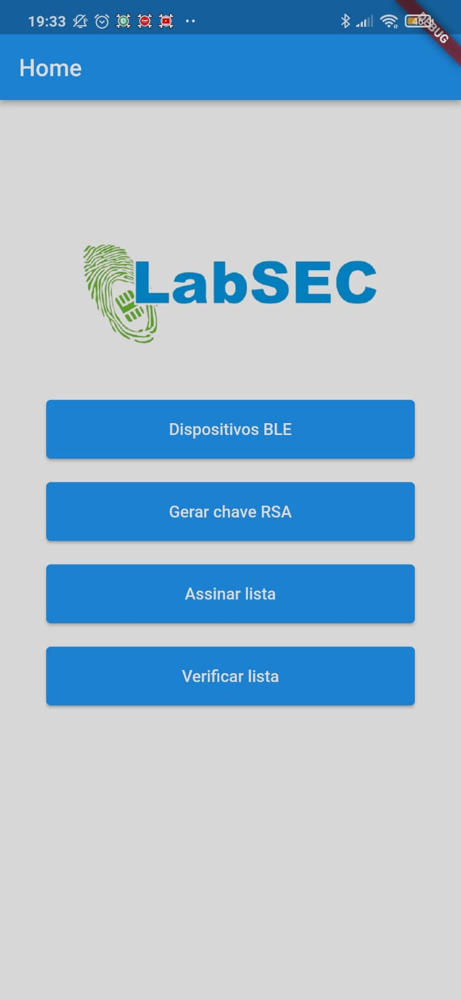
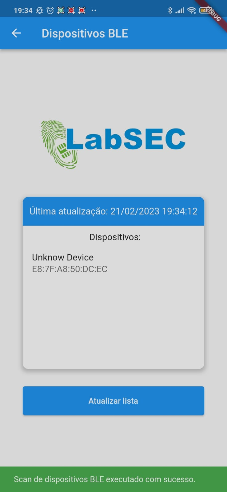
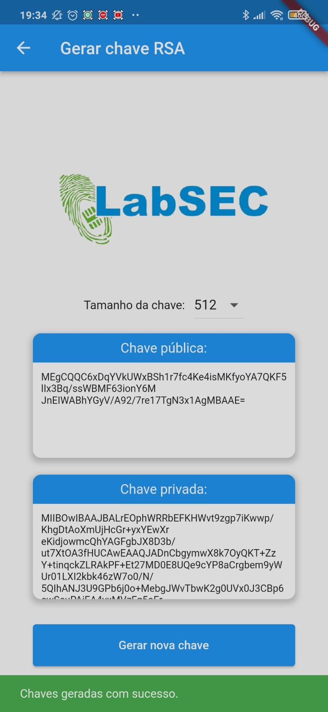
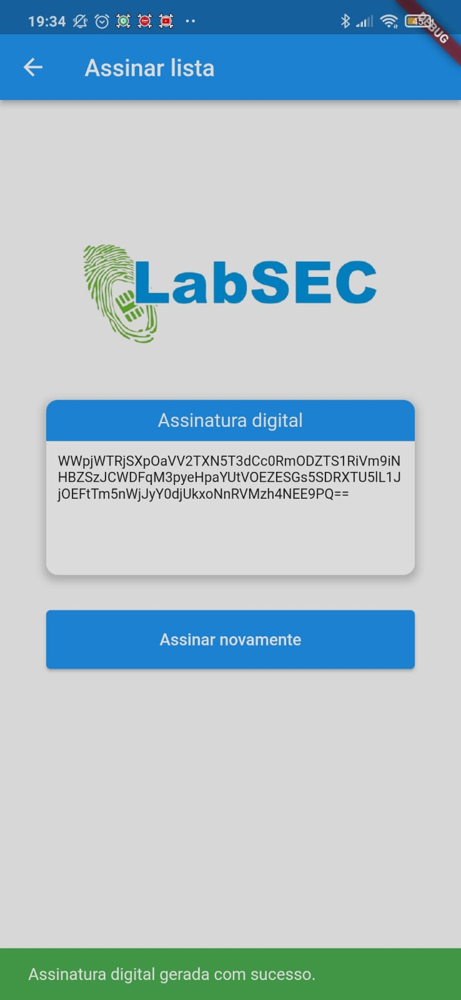
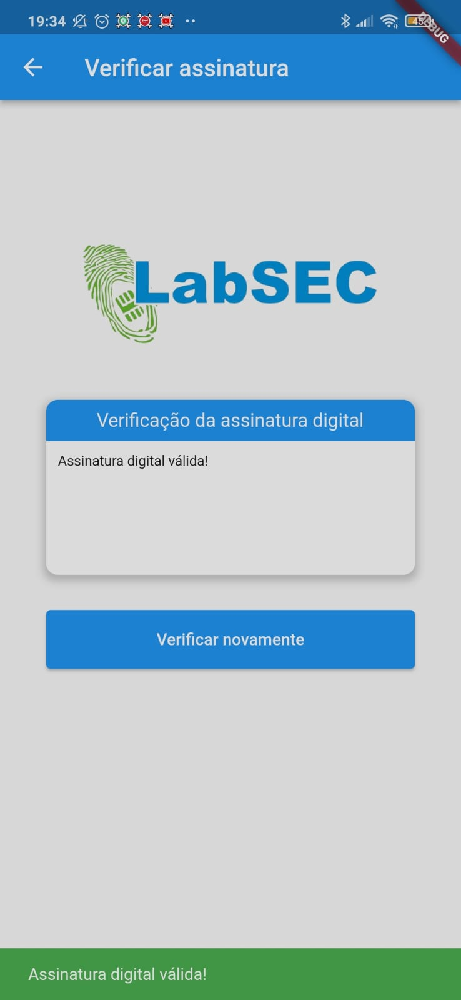

# Desafio Mobile App - LabSec

Repositório para o desafio de desenovlvimento de um aplicativo mobile para o PS do LabSec (Laboratório de Segurança em Computação)

<br>

## Primeira vez com Flutter?

Um ponto de partida para um aplicativo Flutter.

Alguns recursos para você começar se este for seu primeiro projeto Flutter:

-   [Lab: Escreva seu primeiro aplicativo Flutter](https://docs.flutter.dev/get-started/codelab)
-   [Livro de receitas: amostras úteis do Flutter](https://docs.flutter.dev/cookbook)

Para obter ajuda para começar com o desenvolvimento do Flutter, veja o
[documentação online](https://docs.flutter.dev/), que oferece tutoriais,
amostras, orientação sobre desenvolvimento móvel e uma referência completa da API.

## Proposta de Desenvolvimento

-   Desenvolver uma aplicação móvel (iOS ou Android) utilizando a ferramenta Flutter do Google, possuindo duas funcionalidades essenciais.

    -   [1] Listar dispositivos Bluetooth Low Energy (BLE) próximos.
    -   [2] Realizar operações criptográficas utilizando o algoritmo RSA: gerar um par de chaves RSA, assinar a lista de dispositivos usando a chave privada e verificar a assinatura gerada.

-   Foi sugerido o desenvolvimento de 6 telas:
    -   [1] Tela inicial que leva para as outras telas;
    -   [2] Tela de varredura dos dispositivos BLE;
    -   [3 e 4 ] Telas para gerenciamento de chave RSA;
    -   [5] Tela de assinatura digital; e
    -   [6] Tela de verificação da assinatura digital.

<br>

## Telas desenvolvidas

<table>
  <tbody>
    <tr>
      <td align="center">Tela 1<br>
        <span>&nbsp;&nbsp;&nbsp;&nbsp;&nbsp;</span>
      </td>
      <td align="center">Tela 2<br>
        <span>&nbsp;&nbsp;&nbsp;&nbsp;&nbsp;</span>
      </td>
      <td align="center">Tela 3<br>
        <span>&nbsp;&nbsp;&nbsp;&nbsp;&nbsp;</span>
      </td>
      <td align="center">Tela 4<br>
        <span>&nbsp;&nbsp;&nbsp;&nbsp;&nbsp;</span>
      </td>
      <td align="center">Tela 5<br>
        <span>&nbsp;&nbsp;&nbsp;&nbsp;&nbsp;</span>
      </td>
    </tr>
    <tr>
        <td><a href="#"></a><br></td>
        <td><a href="#"></a></td>
        <td><a href="#"></a></td>
        <td><a href="#"></a></td>
        <td><a href="#"></td>
    </tr>
  </tbody>
</table>

<br>

## Como posso testar esse código na minha máquina local?

Antes de qualquer coisa, você precisa ter em sua máquina o flutter e o android-studio. Para isso, acesse e siga o tutorial de:

- [Flutter Install](https://docs.flutter.dev/get-started/install)

>Se ao final do tutorial o seu
>```
>flutter doctor -v
>```
>não apresentar nenhum erro (ficar tudo verde), você está com sua máquina preparada para rodar projetos em flutter.

- Para esse projeto siga as seguintes instruções:
    1. Crie um novo diretório em algum lugar de sua máquina com o nome que quiser (Opcional - apenas para organIzação)
    2. Dentro do diretório abra o bash;
    3. Clonee o repositório do projeto que esta no github com:
    ```
    git clone https://github.com/theHprogrammer/desafio_mobile.git
    ```
    4. Entre no projeto clonado (Se voce estiver com o terminal aberto, pode usar cd "nome-do-diretorio/" sem as aspas);
    5. Dentro do diretório clonado você terá duas opções:
    > 1.1 No terminal execute "flutter pub get" para baixar as dependências.
    >
    > 1.2 Chame o comando "flutter run".
    >
    > Se nenhum erro ocorrer o projeto será simulado no google-chrome como uma página web, já que por padrão o flutter o coloca como emulador inicial.
    >
    > 2.1 Abra o projeto clonado em uma IDE, recomendo o vscode.
    >
    > 2.2 Instale a Extensão do Flutter.
    >
    > 2.3 Aperte (Ctrl + Shift + p) e procure por Pub: Get Packages ou apenas abra o terminal diretamente pelo vscode e digite flutter pub get
    >
    > 2.4 Abra o arquivo main.dart dentro do diretório lib e aperte F5 ou Ctrl + F5 para emular o projeto.
    >
    > 2.5 Selecione o dispositivo para emular. (Aqui você pode optar por selecionar criar android emulator para simular um dispositivo android, dessa forma o android-studio começara a executar a simulação)

- Se você quiser optar por ter um dispositivo já configurado:
  1. Abra o android-studio;
  2. Clique em More Actions;
  3. Selecione Virtual Device Manager;
  4. Clique em Create device;
  5. Selecione o Pixel 4a ou qualquer outro que tenha a play store disponível;
  6. Selecione a imagem do sistema (Eu optei pela Tiramisu, mas você pode selecionar qualquer uma que quiser);
  7. De um nome para o dispositivo e clique em Finish;
  8. Na hora de executar o projeto, basta selecionar o dispositivo criado.

- Bônus: Emular o projeto no próprio celular.
  1. Ative a depuração USB no modo desenvolvedor do seu celular (cada celular tem uma forma de ativar o modo desenvolvedor, então recomendo procurar no google como fazer isso para o seu dispositivo);
  2. Com a depuração USB ativa, conecte o celular a uma entrada USB e selecione a transferência de arquivo;
  3. No terminal rode "flutter run" ou no vscode F5 ou Ctrl + F5;

## Observação:
Eu recomendo tentar emular esse projeto diretamente no celular. Visto que quando fiz os teste via android-studio o mesmo não detectava os dispositivos Bluetooth.


<br>

## Cloning this Repository

1. On GitHub.com, navigate to the repository's main page.
2. Above the list of files, click code.
3. To clone the repository using HTTPS, under "Clone with HTTPS", click 📋. To clone the repository using an SSH key, including a certificate issued by your organization's SSH certificate authority, click Use SSH, then click 📋. To clone a repository using GitHub CLI, click Use GitHub CLI, then click 📋.
4. Open Git Bash.
5. Type git clone (clone git) and paste the URL you copied earlier.

```bash
$ git clone git@github.com:theHprogrammer/LABSEC_FLUTTER_CHALLENGE.git
```

6. Press Enter to create your local clone.

<br>

## 👨‍💻 Author

<table align="center">
    <tr>
        <td align="center">
            <a href="https://github.com/theHprogrammer">
                
                <br />
                <sub><b>Helder Henrique</b></sub>
            </a>
        </td>    
    </tr>
</table>
<h4 align="center">
   By: <a href="https://www.linkedin.com/in/theHprogrammer/" target="_blank"> Helder Henrique </a>
</h4>
